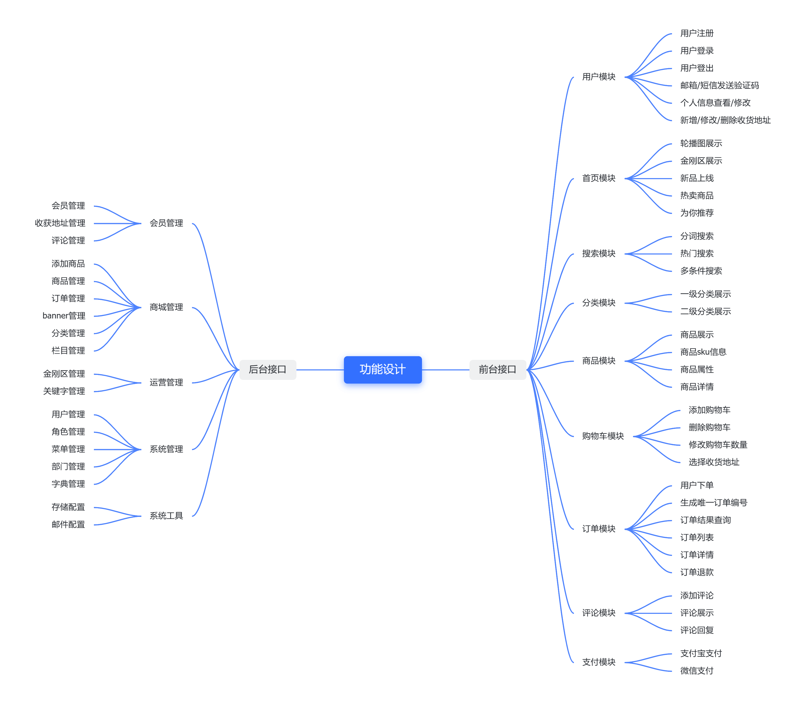
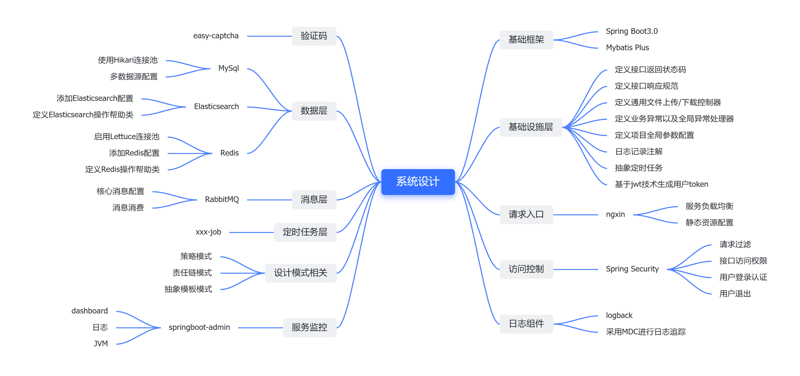

# waynboot-mall

| 分支名称                                                       | Spring Boot 版本 | JDK 版本 |
|--------------------------------------------------------------------|----------------|--------|
| [master](https://github.com/wayn111/waynboot-mall)                     | 3.1.4          | 17     |
| [springboot-2.7](https://github.com/wayn111/waynboot-mall/tree/springboot-2.7) | 2.7            | 1.8    | 
 
---

- [简介](#简介)
- [功能设计](#功能设计)
- [系统设计](#系统设计)
- [技术选型](#技术选型)
- [文件目录](#文件目录)
- [todo](#todo)
- [开发部署](#开发部署)
- [在线体验](#在线体验)
- [演示截图](#演示截图)
- [文件目录](#文件目录)
- [感谢](#感谢)

---

# 简介

waynboot-mall 是一套全部开源的微商城项目，包含三个项目：运营后台、H5 商城和后端接口。实现了一套完整的商城业务，有首页展示、商品分类、商品详情、sku 详情、商品搜索、加入购物车、结算下单、商品评论等一系列功能。商城前后台项目源码全部开源，绝无套路。技术上基于最新得 Springboot3.1，整合了 Redis、RabbitMQ、ElasticSearch 等常用中间件，根据博主多年线上项目实战经验总结开发而来不断优化、完善。

对于初学者而言 waynboot-mall 项目是非常易于部署的，根据readme中的开发部署指南就能成功启动项目。对于非技术人员，本项目也提供了一键安装脚本，能在五分钟内启动商城前后台所有服务。

- H5商城项目 https://github.com/wayn111/waynboot-mobile
- 运营后台项目 https://github.com/wayn111/waynboot-admin
- 后端接口项目 https://github.com/wayn111/waynboot-mall

> 如果有任何使用问题，欢迎提交Issue或加wx告知，方便互相交流反馈～ 💘。最后，喜欢的话麻烦给我个star

# 功能设计



# 系统设计



关注公众号：waynblog，每周更新最新技术文章。回复关键字：
- **学习**：加群交流，群内问题都会一一解答。
- **演示账号**：获得线上项目管理后台演示账号。
- **开源项目**：获取博主自己写的三个开源项目，包含PC、H5商城、后台权限管理系统等。


---

# 技术选型

|     | 系统组件             | 采用技术                    | 官网                                                                                       |
| --- | -------------------- | --------------------------- | ------------------------------------------------------------------------------------------ |
| 1   | 基础框架             | Spring Boot                 | https://spring.io/projects/spring-boot                                                     |
| 2   | ORM 框架             | MyBatis-Plus                | https://baomidou.com                                                                       |
| 3   | 工具类库             | hutool                      | https://hutool.cn                                                                          |
| 4   | 流量网关             | Nginx                       | http://nginx.org/en/index.html                                                             |
| 5   | 访问控制             | Spring Security             | https://spring.io/projects/spring-security                                                 |
| 6   | 日志记录             | Nginx                       | https://logback.qos.ch/                                                                    |
| 7   | 验证码               | easy-captcha                | https://github.com/ele-admin/EasyCaptcha                                                   |
| 8   | 数据库连接池         | HikariCP                    | https://github.com/brettwooldridge/HikariCP                                                |
| 9   | Redis 客户端         | Lettuce                     | https://lettuce.io                                                                         |
| 10  | Elasticsearch 客户端 | Java High Level REST Client | https://www.elastic.co/guide/en/elasticsearch/client/java-rest/current/java-rest-high.html |
| 11  | 消息队列             | RabbitMQ                    | https://www.rabbitmq.com                                                                   |
| 12  | 定时任务             | xxl-job                     | https://www.xuxueli.com/xxl-job                                                            |
| 13  | 服务监控             | spring-boot-admin           | https://docs.spring-boot-admin.com/current/getting-started.html                            |

---

# todo

- [x] 订单详情页面
- [x] 完善支付功能
- [ ] 商城资讯流
- [ ] 联系客服

---

# 开发部署
由于本项目图片压缩包超过100m不能在github上传，
提供百度网盘地址链接：https://pan.baidu.com/s/16_d0_f6RhVnN_dDobYm9Bw 提取码：rvlk

ps: 也可以加我 wx: waynaqua 获取商城图片
```
# 1. 克隆项目
git clone git@github.com:wayn111/waynboot-mall.git

# 2. 导入项目依赖
将waynboot-mall目录用idea打开，导入maven依赖

# 3. 安装Mysql8.0+、Redis3.0+、RabbitMQ3.0+（含延迟消息插件）、ElasticSearch7.0+（含分词插件）到本地

# 4. 导入sql文件
在项目根目录下，找到`wayn_shop_*.sql`文件，新建mysql数据库wayn_shop，导入其中

# 5. 项目图片部署(注意由于本项目图片压缩包超过100m不能在github上传，请加我的wx:waynaqua ，获取图片压缩包)
在项目根目录下，找到webp.zip文件，将zip中所有图片解压缩部署到D:/waynshop/webp目录下

# 6. 修改Mysql、Redis、RabbitMQ、Elasticsearch连接配置
修改`application-dev.yml`以及`application.yml`文件中数据连接配置相关信息

# 7. 启动项目
后台api：
    进入waynboot-admin-api子项目，找到AdminApplication文件，右键`run AdminApplication`，启动后台项目
h5商城api:
    进入waynboot-mobile-api子项目，找到MobileApplication文件，右键`run MobileApplication`，启动h5商城项目
消费者api：
    进入waynboot-message-consumer子项目，找到MessageApplication文件，右键`run MessageApplication`，启动消费者项目
```
---

# 在线体验

前台演示地址：http://121.4.124.33/mall

- 使用邮箱 + 手机号注册商城用户
- 使用手机号 + 密码登陆

后台演示地址：http://121.4.124.33/admin ， 后台演示账号：关注博主公众号【waynblog】，发送 演示账号

---

# 演示截图

<table>
    <tr>
        <td>商城首页</td>
        <td>更多商品</td>
    </tr>
    <tr>
        <td>商城搜索</td>
        <td>金刚位跳转</td>
    </tr>
    <tr>
        <td>商品详情</td>
        <td>商品分类</td>
    </tr>
    <tr>
        <td>商品sku选择</td>
        <td>购物车查看</td>
    </tr>
    <tr>
        <td>确认下单</td>
        <td>选择支付方式</td>
    </tr>
    <tr>
        <td>下单成功</td>
        <td>订单列表</td>
    </tr>
    <tr>
        <td>商品评论</td>
        <td>我的页面</td>
    </tr>
    <tr>
        <td>登录</td>
        <td>注册</td>
    </tr>
</table>

# 文件目录

```
|-- db-init                        // 数据库初始化脚本
|-- waynboot-monitor               // 监控模块
|-- waynboot-admin-api             // 运营后台api模块，提供后台项目api接口
|   |-- controller                 // 后台接口
|   |-- framework                  // 后台配置相关
|-- waynboot-common                // 通用模块，包含项目核心基础类
|   |-- annotation                
|   |-- base      
|   |-- config
|   |-- constant
|   |-- core
|   |-- enums
|   |-- exception
|   |-- task
|   |-- util
|-- waynboot-data                  // 数据模块，通用中间件数据访问
|   |-- waynboot-data-redis        // redis访问配置模块
|   |-- waynboot-data-elastic      // elastic访问配置模块
|-- waynboot-message-consumer      // 消费者模块，处理订单消息和邮件消息
|-- waynboot-message-core          // 消费者核心模块，队列、交换机配置
|-- waynboot-mobile-api            // H5商城api模块，提供H5商城api接口
|   |-- controller                 // 前台接口
|   |-- framework                  // 前台配置相关
|-- pom.xml                        // maven父项目依赖，定义子项目依赖版本
|-- ...
```

# 感谢

- [panda-mall](https://github.com/Ewall1106/vue-h5-template)
- [litemall](https://github.com/linlinjava/litemall)
- [vant-ui](https://github.com/youzan/vant)
