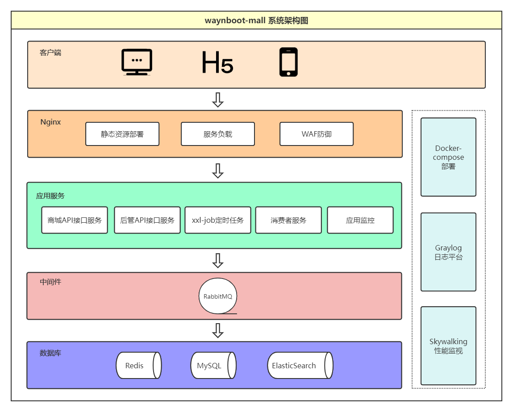
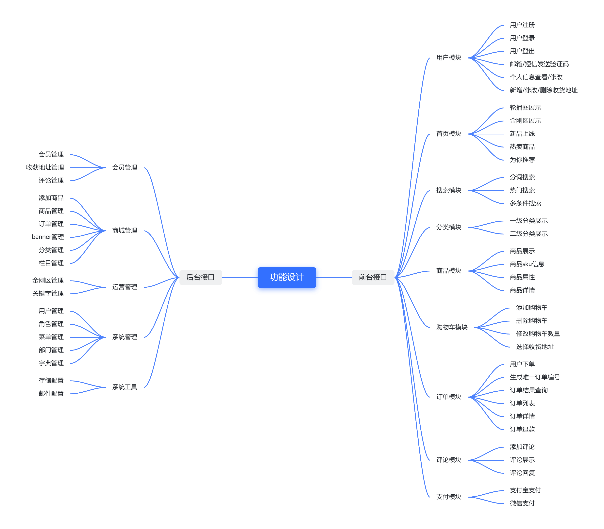
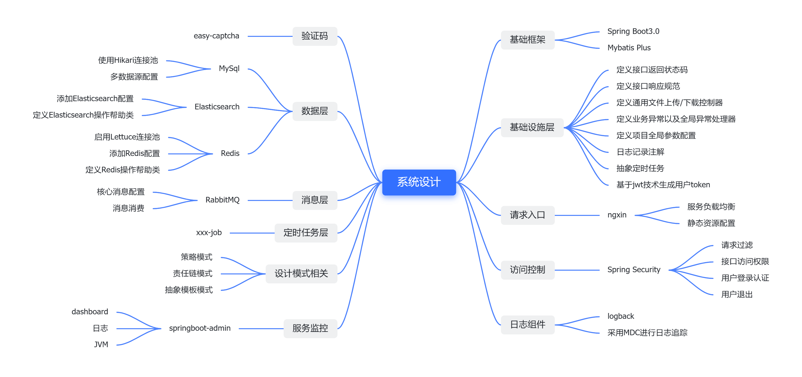
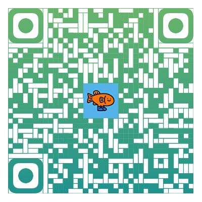
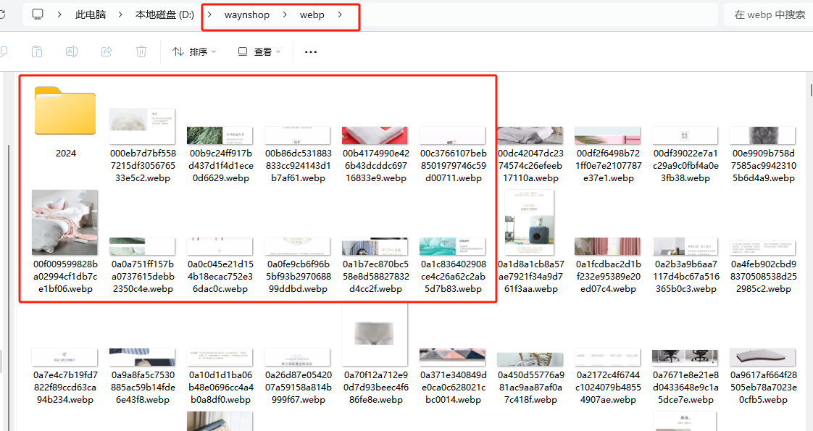
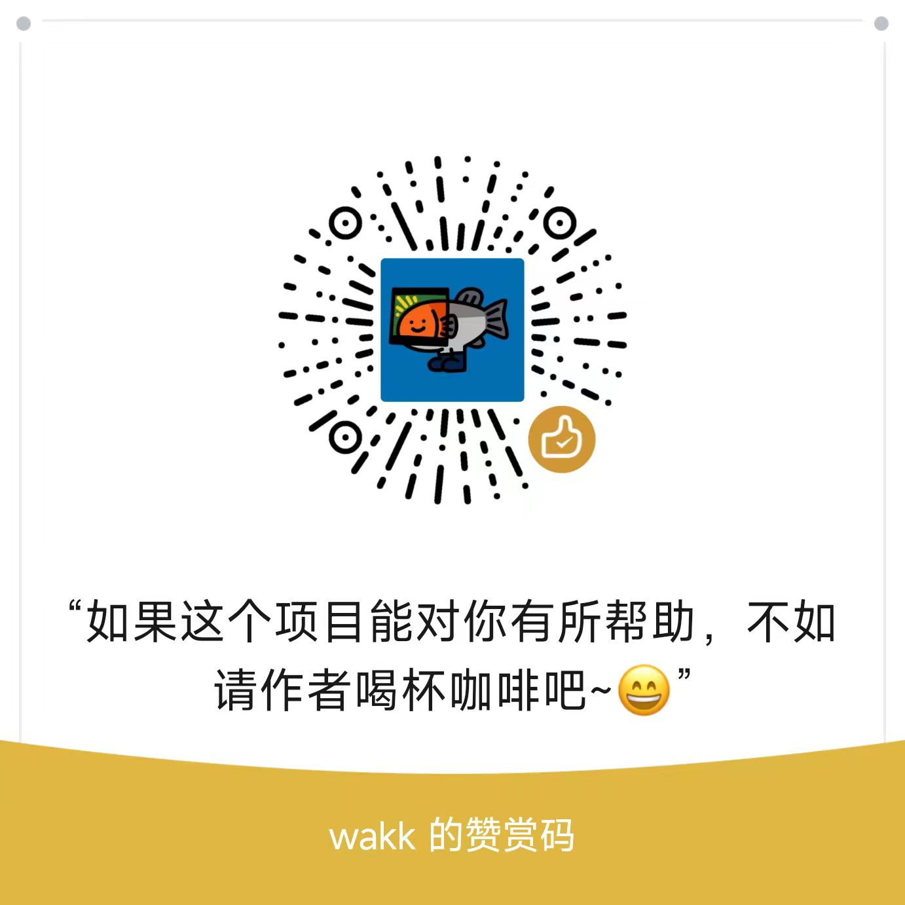

<!--@nrg.languages=zh,en-->
<!--@nrg.defaultLanguage=zh-->
<!--@nrg.fileNamePattern.en=README_en.md-->
# waynboot-mall<!--zh-->
<!--zh-->
| 分支名称                                                                           | Spring Boot 版本 | JDK 版本 |<!--zh-->
|--------------------------------------------------------------------------------|----------------|--------|<!--zh-->
| [master](https://github.com/wayn111/waynboot-mall)                             | 3.1.4          | 17     |<!--zh-->
| [springboot-2.7](https://github.com/wayn111/waynboot-mall/tree/springboot-2.7) | 2.7            | 1.8    | <!--zh-->
<!--zh-->
 <!--zh-->
---<!--zh-->
<!--zh-->
- [简介](#简介)<!--zh-->
- [系统架构](#系统架构)<!--zh-->
- [功能设计](#功能设计)<!--zh-->
- [系统设计](#系统设计)<!--zh-->
- [接口文档](#接口文档)<!--zh-->
- [技术选型](#技术选型)<!--zh-->
- [文件目录](#文件目录)<!--zh-->
- [todo](#todo)<!--zh-->
- [本地开发](#本地开发)<!--zh-->
- [在线体验](#在线体验)<!--zh-->
- [演示gif](#演示gif)<!--zh-->
- [文件目录](#文件目录)<!--zh-->
- [感谢](#感谢)<!--zh-->
<!--zh-->
---<!--zh-->
<!--zh-->
# 简介<!--zh-->
<!--zh-->
🔥waynboot-mall 是一套全部开源的H5商城项目，包含**运营后台、H5 商城前台和后端接口三个项目**<!--zh-->
。实现了一套完整的商城业务，有首页展示、商品分类、商品详情、sku<!--zh-->
详情、商品搜索、加入购物车、结算下单、支付宝/微信支付/易支付对接、我的订单列表、商品评论等一系列功能🔥。<!--zh-->
<!--zh-->
商城所有项目源码全部开源，绝无套路。技术上基于 Spring Boot3.1、Mybatis Plus、Spring Security、Vue2，整合了<!--zh-->
Mysql、Redis、RabbitMQ、ElasticSearch、Nginx 等常用中间件，根据我多年线上项目实战经验总结开发而来不断优化、完善。<!--zh-->
<!--zh-->
对于初学者而言 waynboot-mall 项目是非常易于本地开发部署的，根据 readme 中的本地开发指南就能成功启动项目。<!--zh-->
<!--zh-->
并且提供了 docker-compose 服务器一键部署脚本，只需要十多分钟就能在服务器上启动商城前后台所有服务。<!--zh-->
<!--zh-->
- 后端接口项目 https://github.com/wayn111/waynboot-mall<!--zh-->
- 前端H5商城项目 https://github.com/wayn111/waynboot-mobile<!--zh-->
- 前端运管后台项目 https://github.com/wayn111/waynboot-admin<!--zh-->
<!--zh-->
> 如果有任何使用问题，欢迎提交Issue或加wx告知，方便互相交流反馈～ 💘。最后，喜欢的话麻烦给我个star<!--zh-->
<!--zh-->
# 系统架构<!--zh-->
<!--zh-->
<!--zh-->
<!--zh-->
# 功能设计<!--zh-->
<!--zh-->
<!--zh-->
<!--zh-->
# 系统设计<!--zh-->
<!--zh-->
<!--zh-->
<!--zh-->
关注我的公众号：程序员wayn，专注技术干货输出、分享开源项目。回复关键字：<!--zh-->
<!--zh-->
- **加群**：加群交流，探讨技术问题。<!--zh-->
- **演示账号**：获得 waynboot-mall 商城后台演示账号。<!--zh-->
- **开源项目**：获取我写的三个开源项目，包含PC、H5商城、后台权限管理系统等。<!--zh-->
- **wayn商城资料**：获取wayhboot-mall项目配套资料以及商城图片压缩包下载地址。<!--zh-->
- **加微信**：联系我。<!--zh-->
<!--zh-->
<!--zh-->
<!--zh-->
---<!--zh-->
<!--zh-->
# 接口文档<!--zh-->
本项目使用 apifox 提供的在线文档功能供大家在线查看以及浏览。<!--zh-->
<!--zh-->
文档地址：https://apifox.com/apidoc/shared-f48b11f5-6137-4722-9c70-b9c5c3e5b09b<!--zh-->
<!--zh-->
<!--zh-->
<!--zh-->
<!--zh-->
---<!--zh-->
<!--zh-->
# 技术选型<!--zh-->
<!--zh-->
|    | 系统组件              | 采用技术                        | 官网                                                                                         |<!--zh-->
|----|-------------------|-----------------------------|--------------------------------------------------------------------------------------------|<!--zh-->
| 1  | 基础框架              | Spring Boot                 | https://spring.io/projects/spring-boot                                                     |<!--zh-->
| 2  | ORM 框架            | MyBatis-Plus                | https://baomidou.com                                                                       |<!--zh-->
| 3  | 工具类库              | hutool                      | https://hutool.cn                                                                          |<!--zh-->
| 4  | 流量网关、网关安全         | openresty                   | https://openresty.org/cn/                                                                  |<!--zh-->
| 5  | 访问控制              | Spring Security             | https://spring.io/projects/spring-security                                                 |<!--zh-->
| 6  | 日志记录              | logback                     | https://logback.qos.ch/                                                                    |<!--zh-->
| 7  | 验证码               | easy-captcha                | https://github.com/ele-admin/EasyCaptcha                                                   |<!--zh-->
| 8  | 数据库连接池            | HikariCP                    | https://github.com/brettwooldridge/HikariCP                                                |<!--zh-->
| 9  | Redis 客户端         | Lettuce                     | https://lettuce.io                                                                         |<!--zh-->
| 10 | Elasticsearch 客户端 | Java High Level REST Client | https://www.elastic.co/guide/en/elasticsearch/client/java-rest/current/java-rest-high.html |<!--zh-->
| 11 | 消息队列              | RabbitMQ                    | https://www.rabbitmq.com                                                                   |<!--zh-->
| 12 | 定时任务              | xxl-job                     | https://www.xuxueli.com/xxl-job                                                            |<!--zh-->
| 13 | 服务监控              | spring-boot-admin           | https://docs.spring-boot-admin.com/current/getting-started.html                            |<!--zh-->
<!--zh-->
---<!--zh-->
<!--zh-->
# todo<!--zh-->
<!--zh-->
- [x] 订单详情页面<!--zh-->
- [x] 完善支付功能<!--zh-->
<!--zh-->
---<!--zh-->
<!--zh-->
# 本地开发<!--zh-->
<!--zh-->
由于本项目图片压缩包超过 100m 不能在 github 上传，所以下载链接放在我的公众号【程序员wayn】，<!--zh-->
回复 wayn商城图片 获取<!--zh-->
<!--zh-->
## 1. 克隆项目<!--zh-->
<!--zh-->
git clone git@github.com:wayn111/waynboot-mall.git<!--zh-->
<!--zh-->
## 2. 导入项目依赖<!--zh-->
<!--zh-->
将 waynboot-mall 目录用 idea 打开，导入 maven 依赖<!--zh-->
<!--zh-->
## 3. 安装 Jdk17、Mysql8.0+、Redis3.0+、RabbitMQ3.0+（含延迟消息插件）、ElasticSearch7.0+（含分词、拼英插件）到本地<!--zh-->
<!--zh-->
## 4. 导入 sql 文件<!--zh-->
<!--zh-->
在项目根目录下，找到 `wayn_shop_*.sql` 文件，新建 mysql 数据库 wayn_shop，导入其中<!--zh-->
<!--zh-->
## 5. 项目图片部署<!--zh-->
<!--zh-->
下载商城图片压缩包，将 zip 中所有图片解压缩部署到 D:/waynshop/webp 目录下，如下<!--zh-->
<!--zh-->
<!--zh-->
<!--zh-->
## 6. 修改Mysql、Redis、RabbitMQ、Elasticsearch连接配置<!--zh-->
<!--zh-->
修改`application-dev.yml`以及`application.yml`文件中数据连接配置相关信息<!--zh-->
<!--zh-->
## 7. 启动项目<!--zh-->
<!--zh-->
- 后台api：<!--zh-->
  进入waynboot-admin-api子项目，找到AdminApplication文件，右键`run AdminApplication`，启动后台项目<!--zh-->
- h5商城api:<!--zh-->
  进入waynboot-mobile-api子项目，找到MobileApplication文件，右键`run MobileApplication`，启动h5商城项目<!--zh-->
- 消费者api：<!--zh-->
  进入waynboot-message-consumer子项目，找到MessageApplication文件，右键`run MessageApplication`，启动消费者项目<!--zh-->
<!--zh-->
## 8. 启动商城H5项目<!--zh-->
<!--zh-->
请查看商城H5前端项目 https://github.com/wayn111/waynboot-mobile ，readme文档，进行本地启动<!--zh-->
<!--zh-->
- 使用手机号（11位手机号） + 验证码登陆（默认1234）<!--zh-->
<!--zh-->
## 9. 启动商城后管项目<!--zh-->
<!--zh-->
请查看商城后管前端项目 https://github.com/wayn111/waynboot-admin ，readme文档，进行本地启动<!--zh-->
<!--zh-->
---<!--zh-->
<!--zh-->
# 在线体验<!--zh-->
<!--zh-->
前台<!--zh-->
<!--zh-->
- 使用邮箱 + 手机号注册商城用户<!--zh-->
- 使用手机号 + 密码登陆<!--zh-->
<!--zh-->
演示地址以及账号：关注我的公众号【程序员wayn】，发送 演示账号<!--zh-->
<!--zh-->
---<!--zh-->
<!--zh-->
# 服务器部署<!--zh-->
<!--zh-->
对于想要自己部署这个项目的同学又没有开发资源，可以关注公众号【程序员wayn】 发送 **加微信**，提供有偿帮助。<!--zh-->
<!--zh-->
# 咨询指南<!--zh-->
<!--zh-->
商城咨询时请考虑我的时间成本，虽然我是乐于帮助新手解决问题。<!--zh-->
<!--zh-->
但是某些人不仅白嫖咨询大量问题，消耗我的时间成本。而且咨询态度就像是我的客户一样，咨询完了一句谢谢也不会说。<!--zh-->
<!--zh-->
所以如有咨询大量问题，请先付出金钱成本😜。<!--zh-->
<!--zh-->
# 演示gif<!--zh-->
<!--zh-->
## 前台演示<!--zh-->
<!--zh-->
<!--zh-->
<!--zh-->
## 后台演示<!--zh-->
<!--zh-->
<!--zh-->
<!--zh-->
# 文件目录<!--zh-->
<!--zh-->
```<!--zh-->
|-- db-init                           // 数据库初始化脚本<!--zh-->
|-- waynboot-monitor                  // 监控模块<!--zh-->
|-- waynboot-util                     // 帮助模块，包含项目基础帮助类 <!--zh-->
|   |-- constant                      // 基础常量<!--zh-->
|   |-- converter                     // 基础转换类<!--zh-->
|   |-- enums                         // 基础枚举<!--zh-->
|   |-- exception                     // 基础异常<!--zh-->
|   |-- util                          // 基础帮助类<!--zh-->
|-- waynboot-admin-api                // 运营后台api模块，提供后台项目api接口<!--zh-->
|   |-- controller                    // 后台接口<!--zh-->
|   |-- framework                     // 后台配置相关<!--zh-->
|-- waynboot-common                   // 通用模块，包含项目核心基础类<!--zh-->
|   |-- annotation                    // 通用注解      <!--zh-->
|   |-- base                          // 通用注解<!--zh-->
|   |-- core                          // 核心配置，包含项目entity、mapper、service、vo定义<!--zh-->
|   |-- config                        // 通用配置<!--zh-->
|   |-- design                        // 设计模式实现<!--zh-->
|   |-- dto                           // dto定义<!--zh-->
|   |-- request                       // 接口请求定义<!--zh-->
|   |-- reponse                       // 接口响应定义<!--zh-->
|   |-- task                          // 任务相关   <!--zh-->
|   |-- util                          // 通用帮助类   <!--zh-->
|   |-- wapper                        // 通用包装类，包含易支付代码<!--zh-->
|-- waynboot-data                     // 数据模块，通用中间件数据访问<!--zh-->
|   |-- waynboot-data-redis           // redis访问配置模块<!--zh-->
|   |-- waynboot-data-elastic         // elastic访问配置模块<!--zh-->
|-- waynboot-message                  // 消息模块，rabbitmq操作<!--zh-->
|   |-- waynboot-message-core         // rabbitmq消息配置，定义队列、交换机、绑定队列到交换机<!--zh-->
|   |-- waynboot-message-consumer     // rabbitmq消费者，消费消息<!--zh-->
|-- waynboot-mobile-api               // H5商城api模块，提供H5商城api接口<!--zh-->
|   |-- controller                    // 前台接口<!--zh-->
|   |-- framework                     // 前台配置相关<!--zh-->
|-- pom.xml                           // maven父项目依赖，定义子项目依赖版本<!--zh-->
|-- ...<!--zh-->
```<!--zh-->
<!--zh-->
# 感谢<!--zh-->
<!--zh-->
- [panda-mall](https://github.com/Ewall1106/vue-h5-template)<!--zh-->
- [litemall](https://github.com/linlinjava/litemall)<!--zh-->
- [vant-ui](https://github.com/youzan/vant)<!--zh-->
<!--zh-->
# 捐助<!--zh-->
<!--zh-->
<!--zh-->
<!--en-->
<!--en-->
Here's the English translation of the README file:<!--en-->
<!--en-->
---<!--en-->
<!--en-->
# waynboot-mall<!--en-->
<!--en-->
| Branch Name                                                                           | Spring Boot Version | JDK Version |<!--en-->
|---------------------------------------------------------------------------------------|---------------------|-------------|<!--en-->
| [master](https://github.com/wayn111/waynboot-mall)                                    | 3.1.4               | 17          |<!--en-->
| [springboot-2.7](https://github.com/wayn111/waynboot-mall/tree/springboot-2.7)        | 2.7                 | 1.8         |<!--en-->
<!--en-->
---<!--en-->
<!--en-->
- [Introduction](#introduction)<!--en-->
- [System Architecture](#system-architecture)<!--en-->
- [Feature Design](#feature-design)<!--en-->
- [System Design](#system-design)<!--en-->
- [API Documentation](#api-documentation)<!--en-->
- [Technology Stack](#technology-stack)<!--en-->
- [Directory Structure](#directory-structure)<!--en-->
- [Todo](#todo)<!--en-->
- [Local Development](#local-development)<!--en-->
- [Online Demo](#online-demo)<!--en-->
- [Demo GIFs](#demo-gifs)<!--en-->
- [Acknowledgements](#acknowledgements)<!--en-->
<!--en-->
---<!--en-->
<!--en-->
## Introduction<!--en-->
<!--en-->
🔥 waynboot-mall is a fully open-source H5 e-commerce platform comprising **three components: admin backend, H5 storefront, and backend APIs**. It implements complete e-commerce features including homepage display, product categories, product details, SKU details, product search, cart management, order checkout, payment integration (Alipay/WeChat Pay/EasyPay), order tracking, and product reviews. 🔥<!--en-->
<!--en-->
All source code is open-source with no hidden tricks. Built with Spring Boot 3.1, Mybatis Plus, Spring Security, and Vue2, it integrates common middleware like MySQL, Redis, RabbitMQ, ElasticSearch, and Nginx, refined through years of practical experience.<!--en-->
<!--en-->
For beginners, waynboot-mall is easy to deploy locally - just follow the local development guide in this README.<!--en-->
<!--en-->
We also provide docker-compose scripts for one-click server deployment, enabling full service startup within minutes.<!--en-->
<!--en-->
- Backend API: https://github.com/wayn111/waynboot-mall<!--en-->
- H5 Frontend: https://github.com/wayn111/waynboot-mobile<!--en-->
- Admin Frontend: https://github.com/wayn111/waynboot-admin<!--en-->
<!--en-->
> For any issues, please submit an Issue or contact via WeChat. Contributions are welcome - don't forget to star! 💘<!--en-->
<!--en-->
---<!--en-->
<!--en-->
## System Architecture<!--en-->
<!--en-->
<!--en-->
<!--en-->
---<!--en-->
<!--en-->
## Feature Design<!--en-->
<!--en-->
<!--en-->
<!--en-->
---<!--en-->
<!--en-->
## System Design<!--en-->
<!--en-->
<!--en-->
<!--en-->
Follow my WeChat Official Account **"Programmer Wayn"** for technical insights and open-source projects. Reply with keywords:<!--en-->
<!--en-->
- **加群 (Join Group)**: Join discussion groups<!--en-->
- **演示账号 (Demo Account)**: Get admin demo credentials<!--en-->
- **开源项目 (Open Source)**: Access three open-source projects (PC/H5 stores, admin system)<!--en-->
- **wayn商城资料 (Resources)**: Get project resources & image packages<!--en-->
- **加微信 (WeChat)**: Contact me directly<!--en-->
<!--en-->
<!--en-->
<!--en-->
---<!--en-->
<!--en-->
## API Documentation<!--en-->
<!--en-->
Documentation hosted on Apifox:  <!--en-->
https://apifox.com/apidoc/shared-f48b11f5-6137-4722-9c70-b9c5c3e5b09b<!--en-->
<!--en-->
<!--en-->
<!--en-->
---<!--en-->
<!--en-->
## Technology Stack<!--en-->
<!--en-->
| #  | Component               | Technology                      | Official Site                                                                 |<!--en-->
|----|-------------------------|---------------------------------|-------------------------------------------------------------------------------|<!--en-->
| 1  | Base Framework          | Spring Boot                    | https://spring.io/projects/spring-boot                                       |<!--en-->
| 2  | ORM Framework           | MyBatis-Plus                   | https://baomidou.com                                                         |<!--en-->
| 3  | Utility Library         | Hutool                         | https://hutool.cn                                                            |<!--en-->
| 4  | API Gateway             | OpenResty                      | https://openresty.org/cn/                                                    |<!--en-->
| 5  | Access Control          | Spring Security                | https://spring.io/projects/spring-security                                   |<!--en-->
| 6  | Logging                 | Logback                        | https://logback.qos.ch/                                                      |<!--en-->
| 7  | CAPTCHA                 | EasyCaptcha                    | https://github.com/ele-admin/EasyCaptcha                                     |<!--en-->
| 8  | Connection Pool         | HikariCP                       | https://github.com/brettwooldridge/HikariCP                                  |<!--en-->
| 9  | Redis Client            | Lettuce                        | https://lettuce.io                                                           |<!--en-->
| 10 | Elasticsearch Client    | HLRC                           | https://www.elastic.co/guide/en/elasticsearch/client/java-rest/current.html  |<!--en-->
| 11 | Message Queue           | RabbitMQ                       | https://www.rabbitmq.com                                                     |<!--en-->
| 12 | Scheduled Tasks         | XXL-JOB                        | https://www.xuxueli.com/xxl-job                                              |<!--en-->
| 13 | Monitoring              | Spring Boot Admin              | https://docs.spring-boot-admin.com                                           |<!--en-->
<!--en-->
---<!--en-->
<!--en-->
## Todo<!--en-->
<!--en-->
- [x] Order Details Page<!--en-->
- [x] Payment Integration<!--en-->
- [ ] News Feed<!--en-->
- [ ] Customer Service<!--en-->
<!--en-->
---<!--en-->
<!--en-->
## Local Development<!--en-->
<!--en-->
Image package (>100MB) available via WeChat Official Account "Programmer Wayn" (reply "wayn商城图片").<!--en-->
<!--en-->
### 1. Clone Repository<!--en-->
```bash<!--en-->
git clone git@github.com:wayn111/waynboot-mall.git<!--en-->
```<!--en-->
<!--en-->
### 2. Import Dependencies<!--en-->
Open project in IDEA and import Maven dependencies.<!--en-->
<!--en-->
### 3. Install Dependencies<!--en-->
- JDK 17<!--en-->
- MySQL 8.0+<!--en-->
- Redis 3.0+<!--en-->
- RabbitMQ 3.0+ (with delayed message plugin)<!--en-->
- Elasticsearch 7.0+ (with analysis plugins)<!--en-->
<!--en-->
### 4. Initialize Database<!--en-->
Create `wayn_shop` database and import SQL files from project root.<!--en-->
<!--en-->
### 5. Deploy Images<!--en-->
Extract image package to `D:/waynshop/webp`<!--en-->
<!--en-->
<!--en-->
<!--en-->
### 6. Configure Connections<!--en-->
Modify settings in `application-dev.yml` and `application.yml`<!--en-->
<!--en-->
### 7. Start Services<!--en-->
- **Admin API**: Run `AdminApplication` in `waynboot-admin-api`<!--en-->
- **H5 API**: Run `MobileApplication` in `waynboot-mobile-api`<!--en-->
- **Message Consumer**: Run `MessageApplication` in `waynboot-message-consumer`<!--en-->
<!--en-->
### 8. Start Frontends<!--en-->
Follow READMEs for:<!--en-->
- H5 Frontend: https://github.com/wayn111/waynboot-mobile<!--en-->
- Admin Frontend: https://github.com/wayn111/waynboot-admin<!--en-->
<!--en-->
---<!--en-->
<!--en-->
## Online Demo<!--en-->
<!--en-->
**Storefront**:  <!--en-->
Register using email + mobile, login with mobile + password  <!--en-->
Get demo credentials via WeChat Official Account (reply "演示账号")<!--en-->
<!--en-->
---<!--en-->
<!--en-->
## Server Deployment<!--en-->
<!--en-->
For deployment assistance, contact via WeChat (search official account and reply "加微信").<!--en-->
<!--en-->
---<!--en-->
<!--en-->
## Consultation Policy<!--en-->
<!--en-->
While I'm happy to help beginners, please respect time constraints. Extensive consultations may require compensation. 😜<!--en-->
<!--en-->
---<!--en-->
<!--en-->
## Demo GIFs<!--en-->
<!--en-->
### Storefront Demo<!--en-->
<!--en-->
<!--en-->
### Admin Demo<!--en-->
<!--en-->
<!--en-->
---<!--en-->
<!--en-->
## Directory Structure<!--en-->
<!--en-->
```<!--en-->
|-- db-init                           // Database initialization scripts<!--en-->
|-- waynboot-monitor                  // Monitoring module<!--en-->
|-- waynboot-util                     // Utilities<!--en-->
|   |-- constant                      // Constants<!--en-->
|   |-- converter                     // Converters  <!--en-->
|   |-- enums                         // Enumerations<!--en-->
|   |-- exception                     // Exceptions<!--en-->
|   |-- util                          // Helper classes<!--en-->
|-- waynboot-admin-api                // Admin API<!--en-->
|   |-- controller                    // Admin controllers<!--en-->
|   |-- framework                     // Admin configurations<!--en-->
|-- waynboot-common                   // Common module<!--en-->
|   |-- annotation                    // Annotations      <!--en-->
|   |-- base                          // Base classes<!--en-->
|   |-- core                          // Core entities/DAOs/services/VOs<!--en-->
|   |-- config                        // Configurations<!--en-->
|   |-- design                        // Design patterns<!--en-->
|   |-- dto                           // DTOs<!--en-->
|   |-- request                       // Request objects<!--en-->
|   |-- response                      // Response objects  <!--en-->
|   |-- task                          // Task configs   <!--en-->
|   |-- util                          // Utilities  <!--en-->
|   |-- wrapper                       // Payment wrappers<!--en-->
|-- waynboot-data                     // Data access<!--en-->
|   |-- waynboot-data-redis           // Redis config<!--en-->
|   |-- waynboot-data-elastic         // ES config<!--en-->
|-- waynboot-message                  // Messaging<!--en-->
|   |-- waynboot-message-core         // MQ config<!--en-->
|   |-- waynboot-message-consumer     // Message consumers<!--en-->
|-- waynboot-mobile-api               // H5 API<!--en-->
|   |-- controller                    // H5 controllers<!--en-->
|   |-- framework                     // H5 configs<!--en-->
|-- pom.xml                           // Parent POM<!--en-->
```<!--en-->
<!--en-->
---<!--en-->
<!--en-->
## Acknowledgements<!--en-->
<!--en-->
- [panda-mall](https://github.com/Ewall1106/vue-h5-template)<!--en-->
- [litemall](https://github.com/linlinjava/litemall)<!--en-->
- [vant-ui](https://github.com/youzan/vant)<!--en-->
<!--en-->
---<!--en-->
<!--en-->
## Support<!--en-->
<!--en-->
If this project helps you, consider buying me a coffee ☕<!--en-->
<!--en-->
<!--en-->
<!--en-->
--- <!--en-->
<!--en-->
Let me know if you need any adjustments to the translation!<!--en-->
