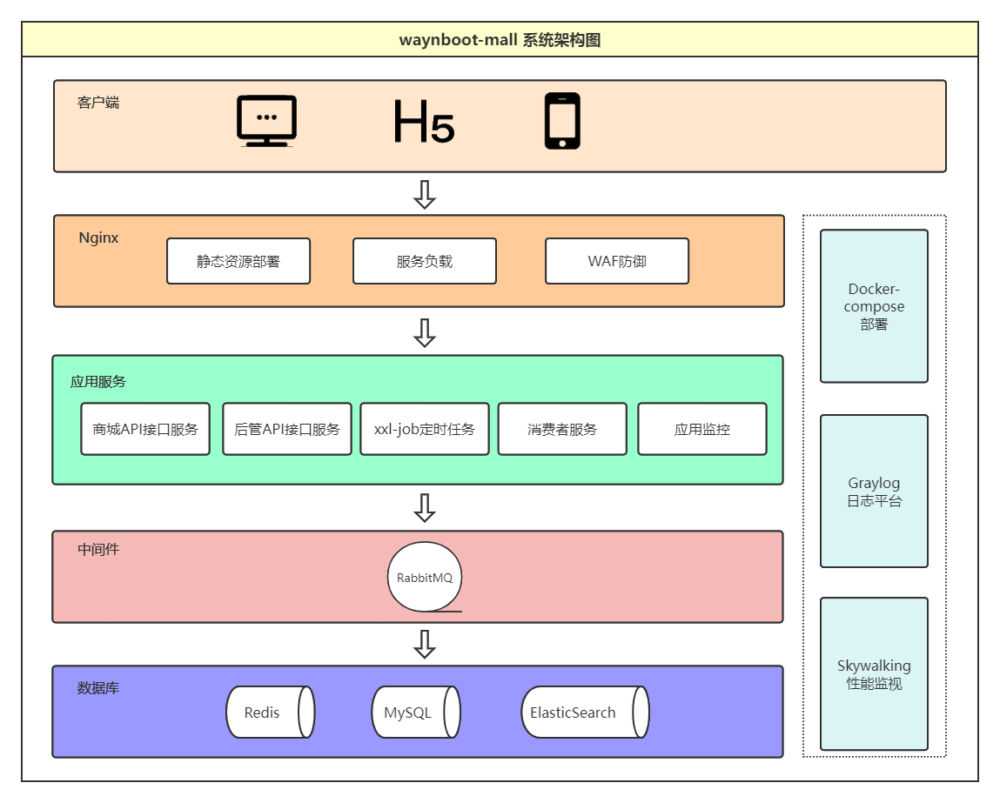
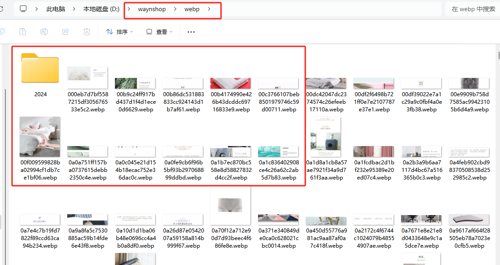
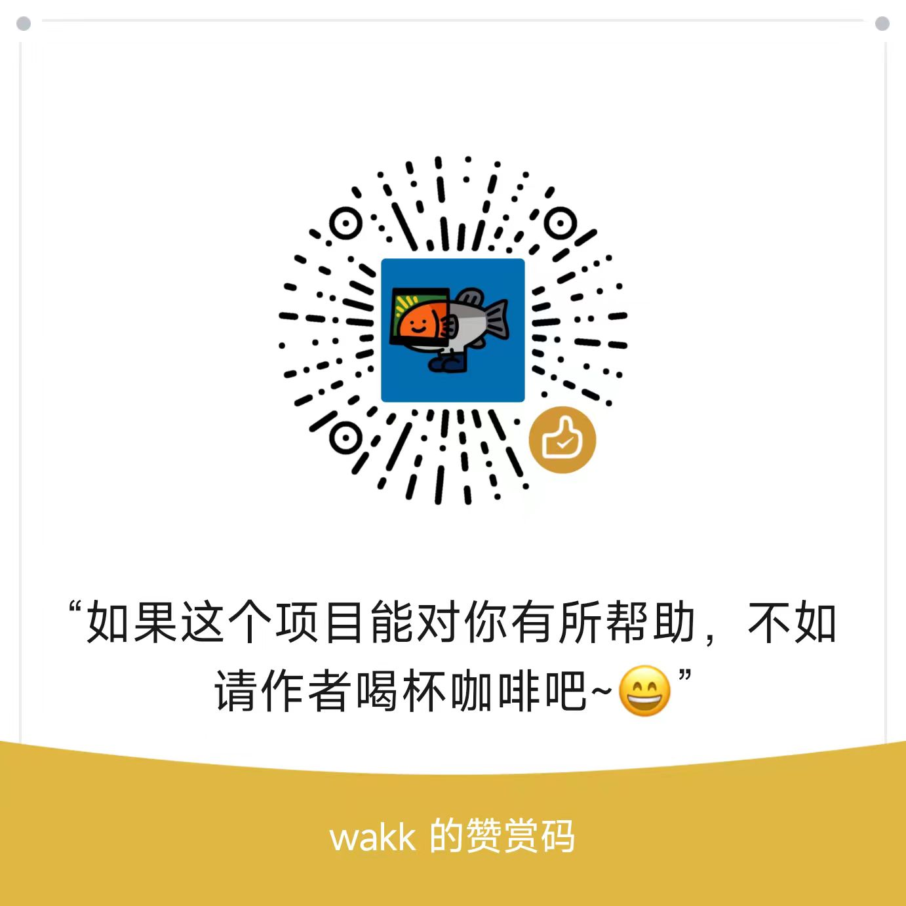

Here's the English translation of the README file:

---

# waynboot-mall

| Branch Name                                                                           | Spring Boot Version | JDK Version |
|---------------------------------------------------------------------------------------|---------------------|-------------|
| [master](https://github.com/wayn111/waynboot-mall)                                    | 3.1.4               | 17          |
| [springboot-2.7](https://github.com/wayn111/waynboot-mall/tree/springboot-2.7)        | 2.7                 | 1.8         |

---

- [Introduction](#introduction)
- [System Architecture](#system-architecture)
- [Feature Design](#feature-design)
- [System Design](#system-design)
- [API Documentation](#api-documentation)
- [Technology Stack](#technology-stack)
- [Directory Structure](#directory-structure)
- [Todo](#todo)
- [Local Development](#local-development)
- [Online Demo](#online-demo)
- [Demo GIFs](#demo-gifs)
- [Acknowledgements](#acknowledgements)

---

## Introduction

🔥 waynboot-mall is a fully open-source H5 e-commerce platform comprising **three components: admin backend, H5 storefront, and backend APIs**. It implements complete e-commerce features including homepage display, product categories, product details, SKU details, product search, cart management, order checkout, payment integration (Alipay/WeChat Pay/EasyPay), order tracking, and product reviews. 🔥

All source code is open-source with no hidden tricks. Built with Spring Boot 3.1, Mybatis Plus, Spring Security, and Vue2, it integrates common middleware like MySQL, Redis, RabbitMQ, ElasticSearch, and Nginx, refined through years of practical experience.

For beginners, waynboot-mall is easy to deploy locally - just follow the local development guide in this README.

We also provide docker-compose scripts for one-click server deployment, enabling full service startup within minutes.

- Backend API: https://github.com/wayn111/waynboot-mall
- H5 Frontend: https://github.com/wayn111/waynboot-mobile
- Admin Frontend: https://github.com/wayn111/waynboot-admin

> For any issues, please submit an Issue or contact via WeChat. Contributions are welcome - don't forget to star! 💘

---

## System Architecture



---

## Feature Design


---

## System Design


Follow my WeChat Official Account **"Programmer Wayn"** for technical insights and open-source projects. Reply with keywords:

- **加群 (Join Group)**: Join discussion groups
- **演示账号 (Demo Account)**: Get admin demo credentials
- **开源项目 (Open Source)**: Access three open-source projects (PC/H5 stores, admin system)
- **wayn商城资料 (Resources)**: Get project resources & image packages
- **加微信 (WeChat)**: Contact me directly


---

## API Documentation

Documentation hosted on Apifox:  
https://apifox.com/apidoc/shared-f48b11f5-6137-4722-9c70-b9c5c3e5b09b


---

## Technology Stack

| #  | Component               | Technology                      | Official Site                                                                 |
|----|-------------------------|---------------------------------|-------------------------------------------------------------------------------|
| 1  | Base Framework          | Spring Boot                    | https://spring.io/projects/spring-boot                                       |
| 2  | ORM Framework           | MyBatis-Plus                   | https://baomidou.com                                                         |
| 3  | Utility Library         | Hutool                         | https://hutool.cn                                                            |
| 4  | API Gateway             | OpenResty                      | https://openresty.org/cn/                                                    |
| 5  | Access Control          | Spring Security                | https://spring.io/projects/spring-security                                   |
| 6  | Logging                 | Logback                        | https://logback.qos.ch/                                                      |
| 7  | CAPTCHA                 | EasyCaptcha                    | https://github.com/ele-admin/EasyCaptcha                                     |
| 8  | Connection Pool         | HikariCP                       | https://github.com/brettwooldridge/HikariCP                                  |
| 9  | Redis Client            | Lettuce                        | https://lettuce.io                                                           |
| 10 | Elasticsearch Client    | HLRC                           | https://www.elastic.co/guide/en/elasticsearch/client/java-rest/current.html  |
| 11 | Message Queue           | RabbitMQ                       | https://www.rabbitmq.com                                                     |
| 12 | Scheduled Tasks         | XXL-JOB                        | https://www.xuxueli.com/xxl-job                                              |
| 13 | Monitoring              | Spring Boot Admin              | https://docs.spring-boot-admin.com                                           |

---

## Todo

- [x] Order Details Page
- [x] Payment Integration
- [ ] News Feed
- [ ] Customer Service

---

## Local Development

Image package (>100MB) available via WeChat Official Account "Programmer Wayn" (reply "wayn商城图片").

### 1. Clone Repository
```bash
git clone git@github.com:wayn111/waynboot-mall.git
```

### 2. Import Dependencies
Open project in IDEA and import Maven dependencies.

### 3. Install Dependencies
- JDK 17
- MySQL 8.0+
- Redis 3.0+
- RabbitMQ 3.0+ (with delayed message plugin)
- Elasticsearch 7.0+ (with analysis plugins)

### 4. Initialize Database
Create `wayn_shop` database and import SQL files from project root.

### 5. Deploy Images
Extract image package to `D:/waynshop/webp`



### 6. Configure Connections
Modify settings in `application-dev.yml` and `application.yml`

### 7. Start Services
- **Admin API**: Run `AdminApplication` in `waynboot-admin-api`
- **H5 API**: Run `MobileApplication` in `waynboot-mobile-api`
- **Message Consumer**: Run `MessageApplication` in `waynboot-message-consumer`

### 8. Start Frontends
Follow READMEs for:
- H5 Frontend: https://github.com/wayn111/waynboot-mobile
- Admin Frontend: https://github.com/wayn111/waynboot-admin

---

## Online Demo

**Storefront**:  
Register using email + mobile, login with mobile + password  
Get demo credentials via WeChat Official Account (reply "演示账号")

---

## Server Deployment

For deployment assistance, contact via WeChat (search official account and reply "加微信").

---

## Consultation Policy

While I'm happy to help beginners, please respect time constraints. Extensive consultations may require compensation. 😜

---

## Demo GIFs

### Storefront Demo


### Admin Demo


---

## Directory Structure

```
|-- db-init                           // Database initialization scripts
|-- waynboot-monitor                  // Monitoring module
|-- waynboot-util                     // Utilities
|   |-- constant                      // Constants
|   |-- converter                     // Converters  
|   |-- enums                         // Enumerations
|   |-- exception                     // Exceptions
|   |-- util                          // Helper classes
|-- waynboot-admin-api                // Admin API
|   |-- controller                    // Admin controllers
|   |-- framework                     // Admin configurations
|-- waynboot-common                   // Common module
|   |-- annotation                    // Annotations      
|   |-- base                          // Base classes
|   |-- core                          // Core entities/DAOs/services/VOs
|   |-- config                        // Configurations
|   |-- design                        // Design patterns
|   |-- dto                           // DTOs
|   |-- request                       // Request objects
|   |-- response                      // Response objects  
|   |-- task                          // Task configs   
|   |-- util                          // Utilities  
|   |-- wrapper                       // Payment wrappers
|-- waynboot-data                     // Data access
|   |-- waynboot-data-redis           // Redis config
|   |-- waynboot-data-elastic         // ES config
|-- waynboot-message                  // Messaging
|   |-- waynboot-message-core         // MQ config
|   |-- waynboot-message-consumer     // Message consumers
|-- waynboot-mobile-api               // H5 API
|   |-- controller                    // H5 controllers
|   |-- framework                     // H5 configs
|-- pom.xml                           // Parent POM
```

---

## Acknowledgements

- [panda-mall](https://github.com/Ewall1106/vue-h5-template)
- [litemall](https://github.com/linlinjava/litemall)
- [vant-ui](https://github.com/youzan/vant)

---

## Support

If this project helps you, consider buying me a coffee ☕



--- 

Let me know if you need any adjustments to the translation!
